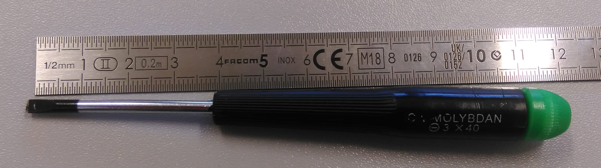
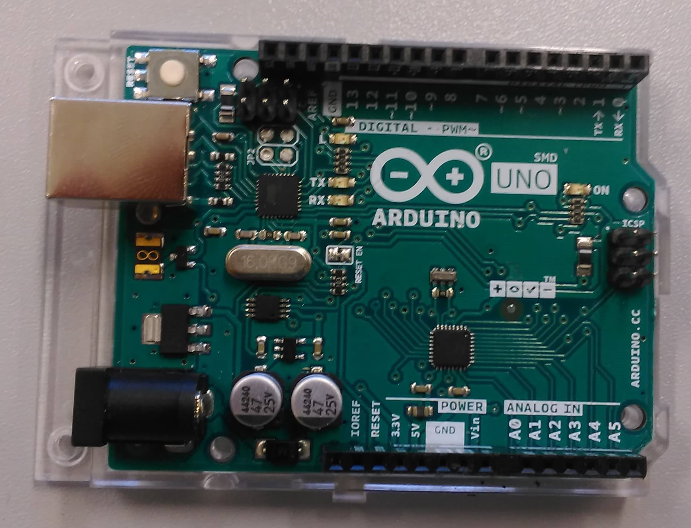
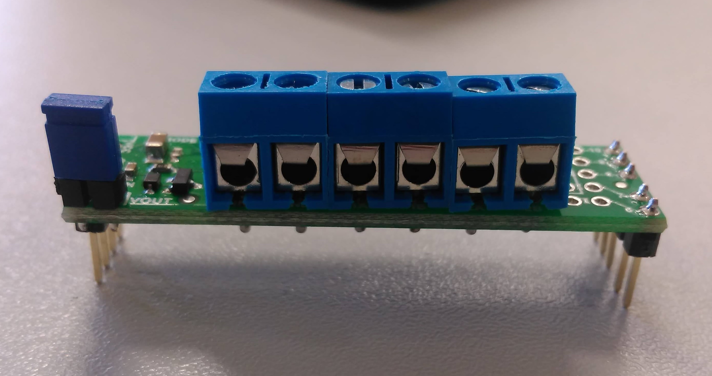
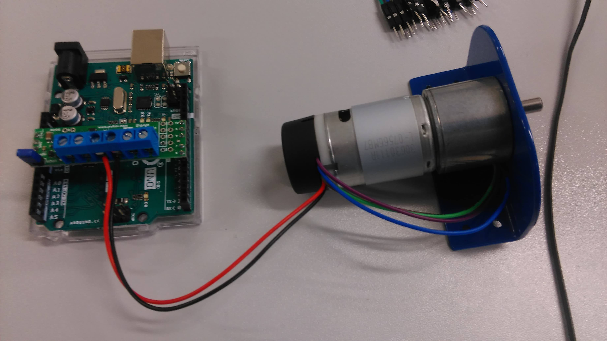
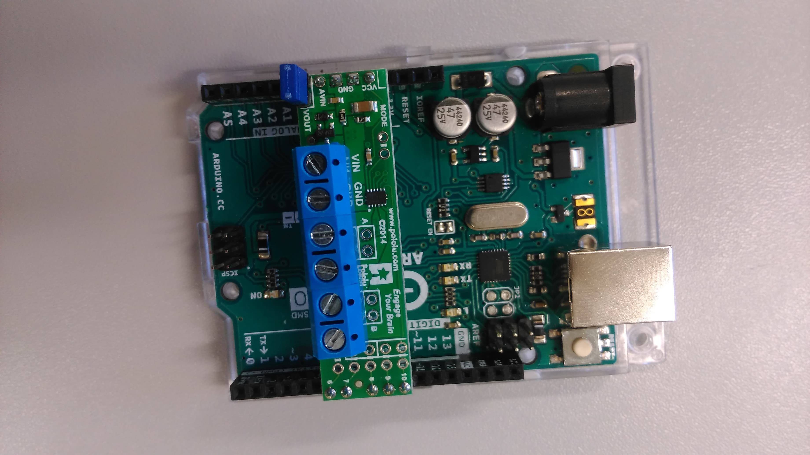

# LPro AIT 2019 - TP1 -> 20/03/2019

- Writer name : PELENC GUILHEM

# MOTOR ASSEMBLY 

### 0. PREREQUISITE 
Tool: 
- **1x** Flat Srewdriver 4X40

- **1x** Flat Srewdriver 3X40

Components : 
- **1x** Motor: [EMG30](https://www.gotronic.fr/art-motoreducteur-encodeur-emg30-866.htm)

- **1x** [Arduino Uno](https://store.arduino.cc/)

- **1x** The blue bracket

 - **1x** Motor driver: [Pololu DRV8835 Dual Motor Driver Shield for Arduino](https://www.pololu.com/product/2511)

- **3x** M3.6 Screw

**NOT FORGET TO PREPARE THIS OBJECTS BEFORE READ ASSEMBLY PROCEDURE**

### 1. ASSENBLY PROCEDURE WHIT BLUE SUPPORT 
--------------------------------------------

--------------------------------------------

1. Place the rotation axis of motor in the hole (diameter = 1cm) of the blue bracket.
2. Match the mounting holes of the motor with mounting holes of the blue bracket

3. Place the screws with the flat screwdriver into the holes (diameter = 0.3mm)

### 2. ASSENBLY PROCEDURE MOTOR DRIVER ONT THE ARDUINO
--------------------------------------------

--------------------------------------------
1. Place the motor driver on the arduino

**Match the pin Avin (motor driver ) with the pin Vin (Arduino) like the picture**

2. Connect the red wire in M1A terminal and the black wire in  M1B terminal.
**The other wire are not used.**

**Names of the terminal are write below the motor driver.**

### 3.  PROCEDURE TO CONTROL THE MOTOR WITH THE CODE AND TEST 

#### 3.1 Upload the code

1. Open [Arduino Software](https://www.arduino.cc/en/main/software)
2. Install librairies [librairies](https://github.com/pololu/drv8835-motor-shield)on arduino.
3. Search the code in **lpro_ait_tp1_teamX\sources\motor_control_open_loop**
4. Upload the code on the arduino after have connect the wire betwenn the PC and the Arduino. 
5. The code start alone. 

#### 3.2 TEST the code

