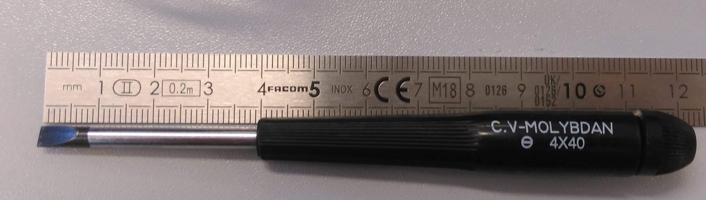
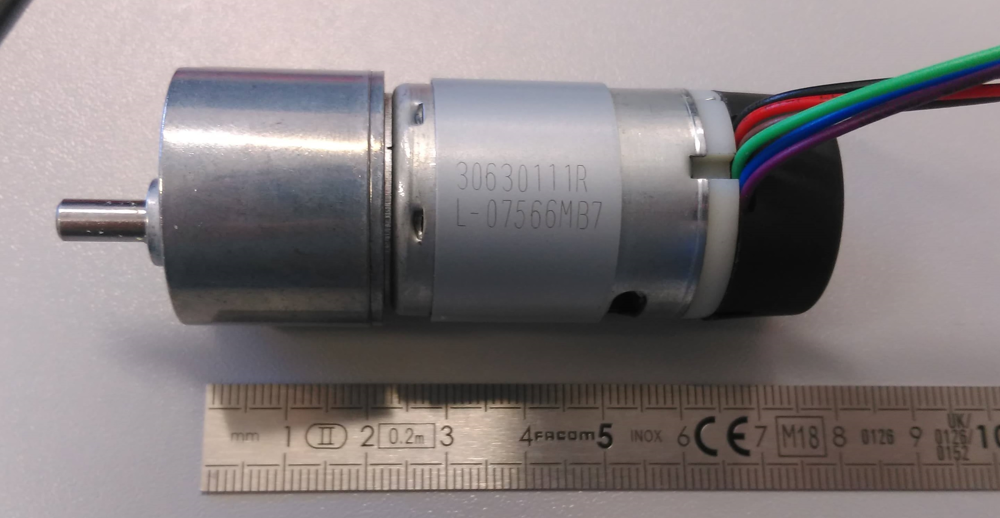
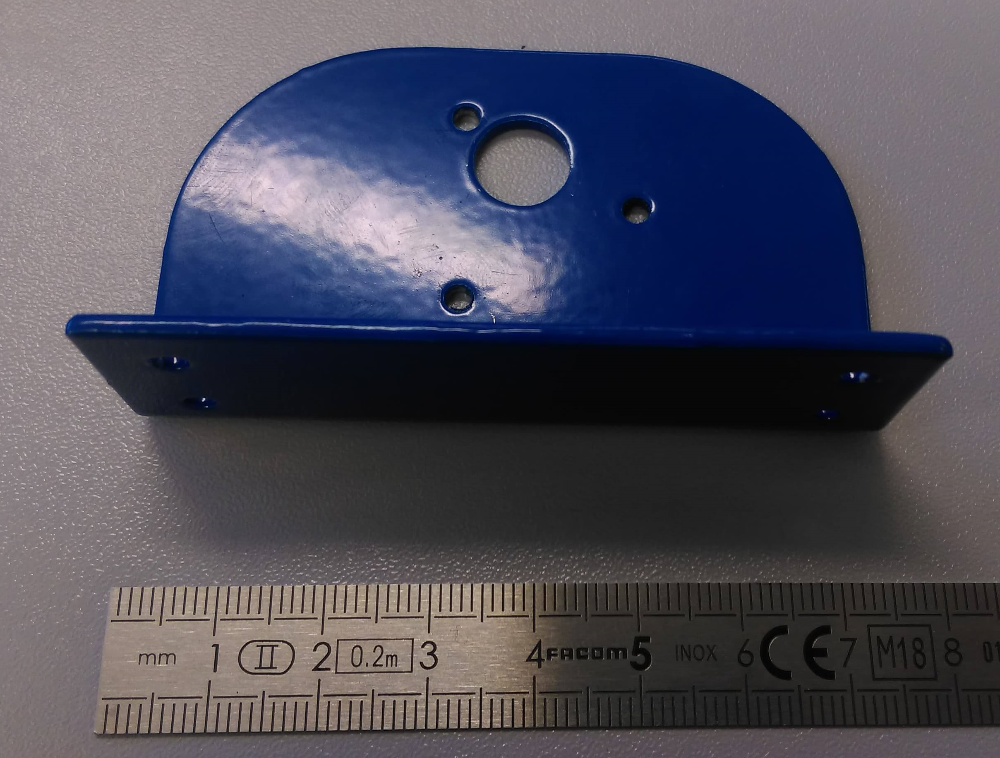
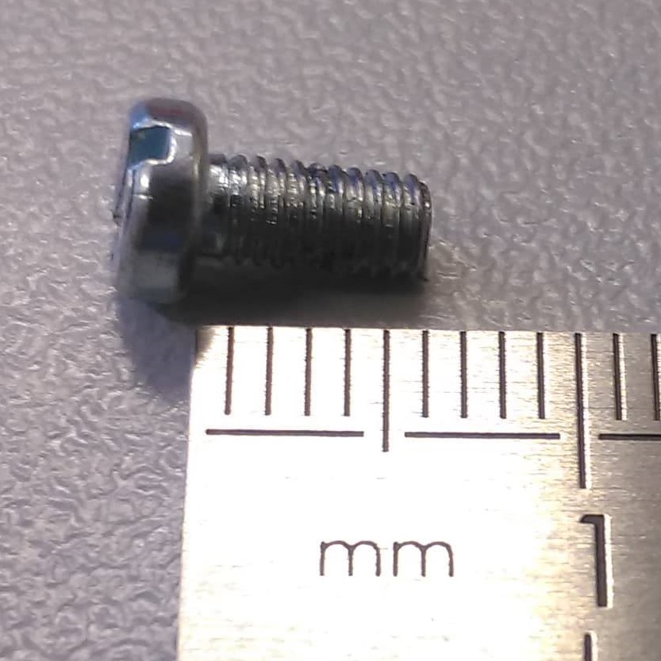
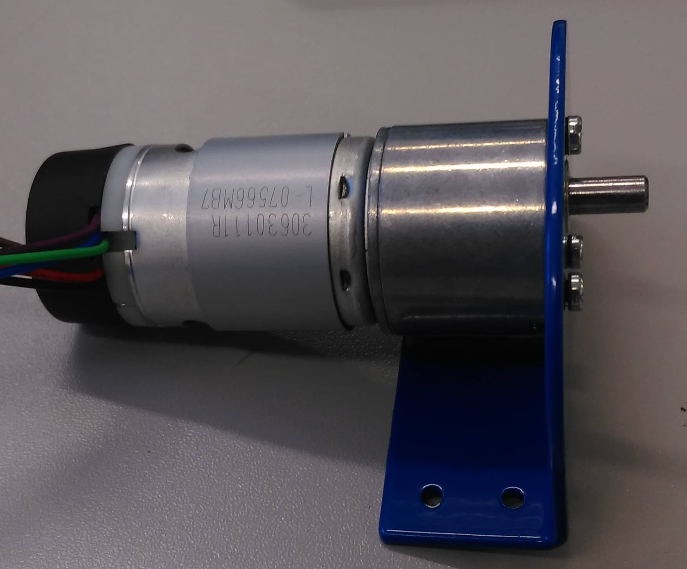
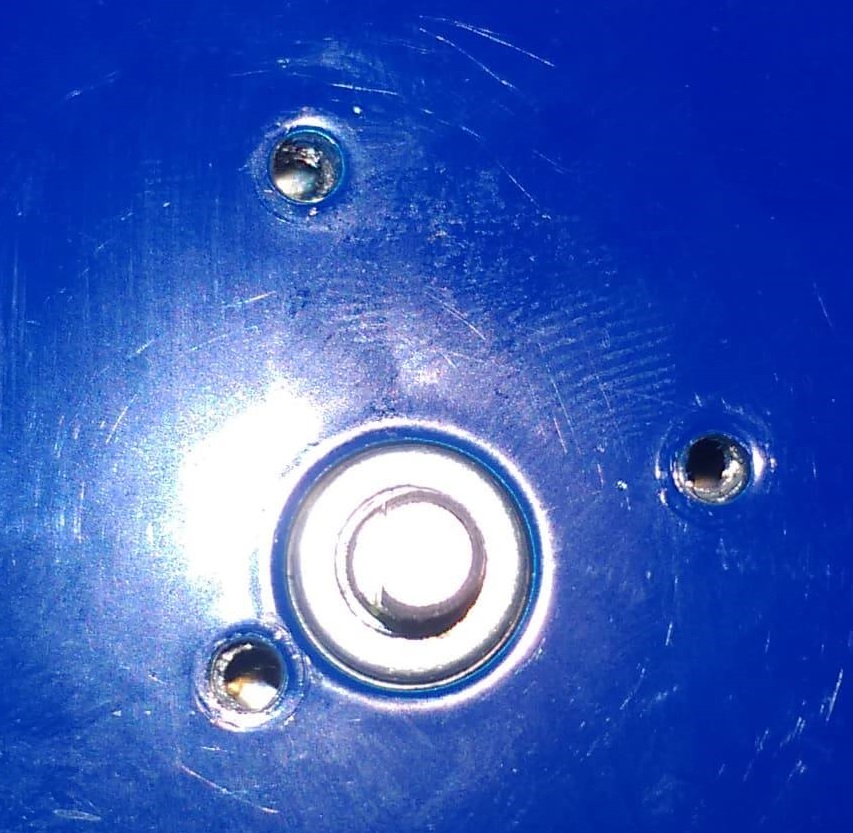
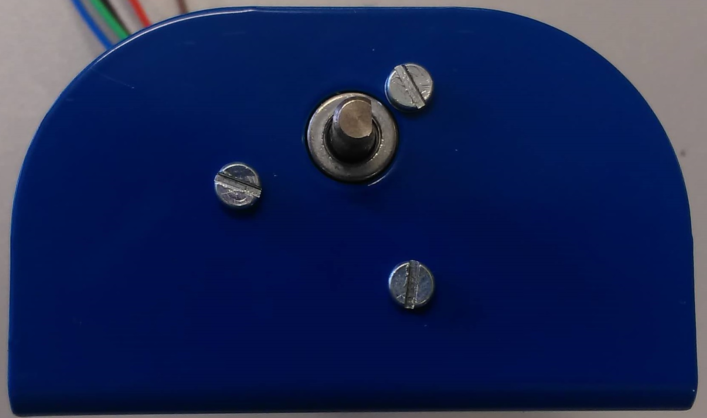

# LPro AIT 2019 - TP1 -> 20/03/2019

- Writer name : PELENC GUILHEM

# MOTOR ASSEMBLY 

### 0. PREREQUISITE 
Tool: 
- **1x** Flat Srewdriver 4X40

Components : 
- **1x** Motor: [EMG30](https://www.gotronic.fr/art-motoreducteur-encodeur-emg30-866.htm)

- **1x** The blue bracket

- **3x** M3.6 Screw

**NOT FORGET TO PREPARE THIS OBJECTS BEFORE READ ASSEMBLY PROCEDURE**

### 1. ASSENBLY PROCEDURE WHIT BLUE SUPPORT 
--------------------------------------------

--------------------------------------------

1. Place the rotation axis of motor in the hole(diameter = 1cm) of the blue bracket.
2. Match the mounting holes of the motor with mounting holes of the blue bracket

3. Place the screws with the flat screwdriver into the holes (diameter = 0.3mm)

### 2. ASSENBLY PROCEDURE WHIT BLUE SUPPORT